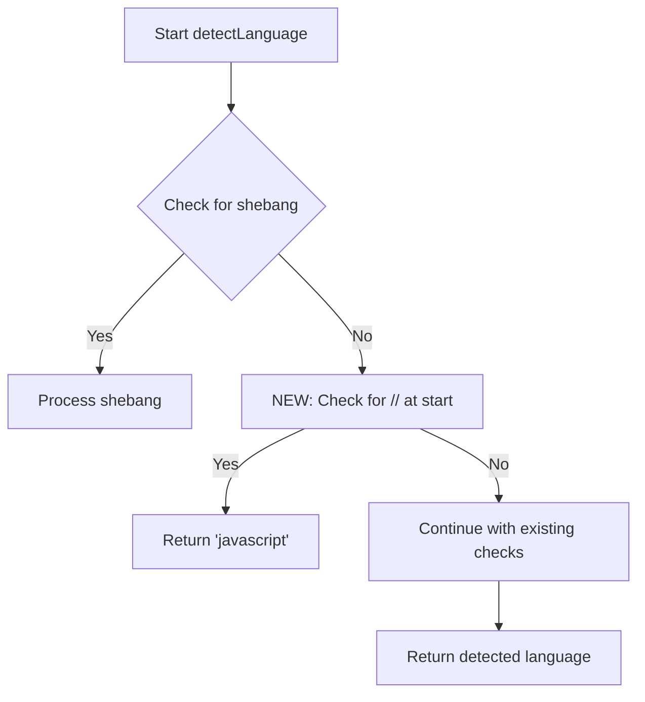

# Implementation Plan: JavaScript Detection for Lines Starting with "//"

## Overview

This document outlines the plan for enhancing the code-expander block to detect JavaScript code when a line starts with "//". This improvement will ensure better syntax highlighting and language detection for JavaScript code snippets.

## Current Functionality

The code-expander block currently detects JavaScript through:
- JavaScript-specific import patterns
- Presence of keywords like 'function', 'var', or 'const'

However, it doesn't detect JavaScript when a line starts with "//", which is a common JavaScript comment syntax.

## Implementation Details

### Location of Change

- **File**: `blocks/code-expander/code-expander.js`
- **Function**: `detectLanguage(code)`
- **Placement**: After the shebang checks (around line 82), before the Python import checks

### Code Change

```javascript
// Check if the first line starts with "//" for JavaScript comments
if (firstLine.trim().startsWith('//')) {
  return 'javascript';
}
```

### Implementation Steps

1. Add the new check after the shebang checks but before the Python import checks
2. Ensure proper indentation and code style
3. Test the change with various code snippets
4. Verify that other language detection still works correctly

## Flow Diagram



## Testing Approach

1. Test with code snippets that start with "//" comments
2. Verify that they are correctly identified as JavaScript
3. Ensure that other language detection still works correctly
4. Test edge cases like mixed language patterns

## Benefits

- Improved language detection for JavaScript code snippets
- Better syntax highlighting for JavaScript code
- Enhanced user experience when viewing code with JavaScript comments

## Next Steps After Implementation

1. Consider adding detection for other common JavaScript patterns
2. Evaluate if similar detection improvements could benefit other languages
3. Document the changes in the code-expander block's documentation