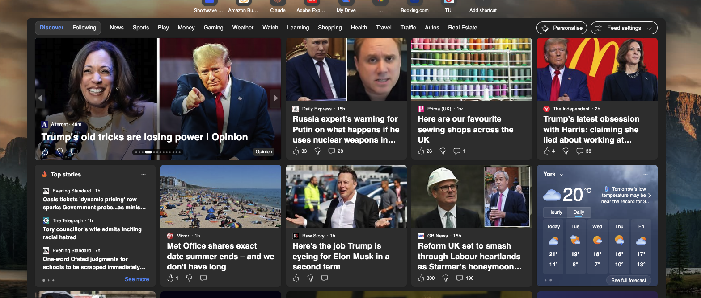

# UI for a newsfeed

This is an UI for a newsfeed, it includes weather in the current location and the ability to choose a tab for different news stories.
Please make a number of blocks to recreate this type of thing, the tab headings come from the newsfeed json, along with image, title, and the article.
The code should include the ability to detect the users current geo-location.

When Creating blocks remember to provide sample json  and csv files using franklin guidance for these files
