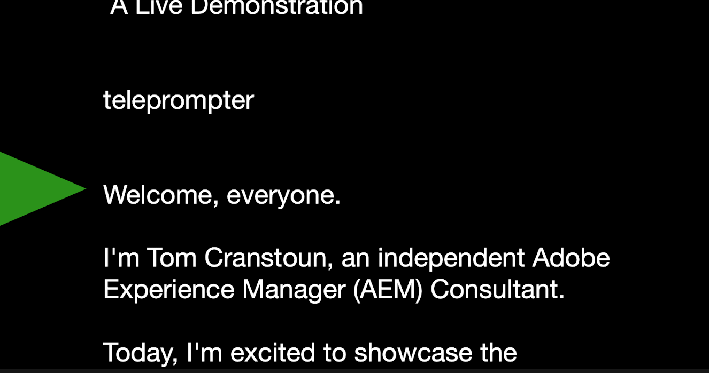

# Enhanced Teleprompter Block

## AI Prompt, (c) Tom Cranstoun , 10 Sep 2024, V 1.0

**Goal:** Create an advanced Franklin block named "teleprompter3" with the following functionalities and improvements.

## Initial State

* Display a clickable icon on the page when the document loads
* The teleprompter should not be visible until activated
* Icon design:
  * Use a simple, recognizable teleprompter or text icon (Unicode: &#128217;)
  * Position: Fixed, top left corner of the viewport
  * Size: 48x48 pixels
  * Hover effect: Slight enlargement and opacity change

## Content Processing

* Read all text content in the DOM below the block
* Store each text node's content as a separate line in an array called `allLines`
* Extract the first `<h1>` element as the title

## Display

* Background: Semi-transparent black (rgba(0, 0, 0, 0.8))
* Dimensions: 80% width, max-width 800px, height 400px
* Position: Fixed, centered on screen when activated
* Title:
  * Display at the top of the teleprompter
  * Font: 24px, bold, centered
* Text Display:
  * Font: 20px (base), white color
  * Alignment: Left-aligned
  * Current Line:
    * Font: 28px, bold
    * Displayed at the top
  * Gap: 20px space after the current line
  * Next 3 Lines:
    * Font: 24px
    * Opacity: 0.7 (slightly dimmed)
* Timer:
  * Position: Top right corner
  * Format: Minutes and seconds (MM:SS)
  * Font: 18px
  * Background: Semi-transparent black

## Scrolling Mechanism

* Scroll direction: Bottom to top (new lines appear at the bottom)
* Triggers:
  * Mouse wheel
  * Arrow keys (Up/Down/Left/Right)
* Smooth transition between lines

## Control Mechanisms

* Start:
  * Click on the teleprompter icon
* Stop:
  * Press the "Esc" key
  * Hides the teleprompter and shows the icon again
* Pause/Resume:
  * Press the spacebar
  * Display "PAUSED" message when paused
  * Timer stops counting when paused

## Draggable Functionality

* Make the entire teleprompter draggable
* Use the teleprompter background as the drag handle
* Exclude the text content area from initiating drag

## Styling

* Cursor:
  * 'move' for draggable areas
  * 'default' for text content area
* User selection:
  * Disabled for draggable areas
  * Enabled for text content

## Performance

* Ensure smooth scrolling and dragging with minimal impact on page performance
* Use requestAnimationFrame for timer updates

## Accessibility

* Make the teleprompter focusable
* Ensure all keyboard controls are fully functional
* Add aria labels to the icon for screen readers

## Additional Features

* Handle empty content gracefully
* Prevent text from being cut off by using word-wrap

## Icon Behavior

* When clicked, hide the icon and show the teleprompter
* When teleprompter is closed (Esc key), hide the teleprompter and show the icon again
* Provide a smooth transition between icon and teleprompter states

## Error Handling

* Display a message if no content is available for the teleprompter

## Demo Page

Generate a demo markdown page in franklin format in the scrap folder, with a title, the block, sample metadata and sample text

## note

Note: Ensure that the teleprompter remains hidden until explicitly activated by clicking the icon.
